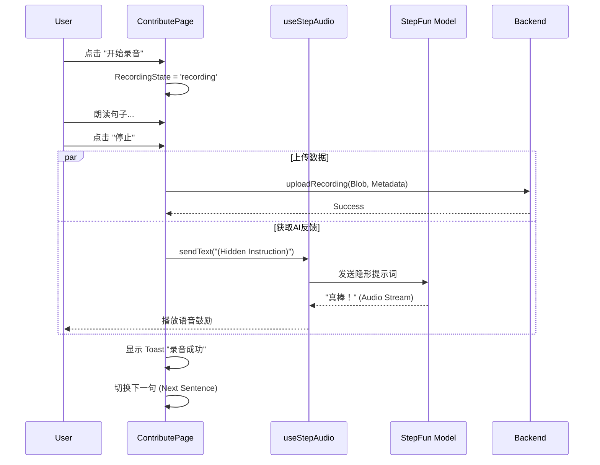

# VoxFlame 前端架构与交互设计指南

> **版本**: 1.0  
> **更新日期**: 2026-01-04  
> **目标读者**: 前端开发者、产品经理

此文档详细描述了 VoxFlame (燃言) 前端应用的页面结构、组件交互逻辑及数据流向，重点解析 **数据贡献页 (Contribute Page)** 的内部状态机与 AI 交互机制。

---

## 1. 核心页面结构 (Site Map)

```mermaid
graph TD
    A[Landing Page (/)] -->|点击"开始贡献"| B[Contribute Page (/contribute)]
    B --> C{用户模式 Mode}
    C -->|默认| D[Chat Mode (AI对话)]
    C -->|选择| E[Guided Mode (跟读录音)]
    C -->|选择| F[Free Mode (自由录音)]
```

- **Landing Page**: 项目介绍、愿景展示、入口。
- **Contribute Page**: 核心业务页，承载所有录音与交互逻辑。

---

## 2. 数据贡献页 (Contribute Page) 深度解析

该页面采用 **单页应用 (SPA)** 模式，通过内部状态 `mode` 切换不同视图，保持 AI 连接不断开。

### 2.1 状态模式 (Modes)

| 模式 | 状态值 `mode` | 用途 | 核心组件 |
|------|--------------|------|----------|
| **AI 对话** | `'chat'` (Default) | 建立信任，引导用户，消除紧张感 | `ChatList`, `VoiceButton` |
| **跟读录音** | `'guided'` | 核心数据采集，标准化语料录制 | `TopicSelector`, `SentenceCard`, `RecordingControl` |
| **自由录音** | `'free'` | 采集非结构化语音，捕捉自然表达 | `TextArea`, `RecordingControl` |

### 2.2 核心交互流程 (Interaction Flow)

#### A. 录音与激励闭环
这是一个典型的 **"行为 -> 反馈"** 闭环设计：

1.  **用户行为**: 点击录音 -> 朗读 -> 点击停止。
2.  **系统处理**:
    *   `AudioProcessor` 停止采集，生成 Blob。
    *   `useVoiceUpload` 上传文件 (带 metadata: `category`, `sentenceId`)。
3.  **双重反馈 (Dual Feedback)**:
    *   **视觉反馈**: 页面顶部弹出绿色 Toast ("太棒了！录音成功！")。
    *   **听觉反馈 (AI)**:
        *   系统自动调用 `sendText("（用户刚刚完成...请鼓励）")` (隐形指令)。
        *   AI 收到指令后，生成语音回复 ("哇，读得真清楚！继续加油！")。
        *   **目的**: 模拟真实的陪伴感，减少枯燥感。

#### B. 数据流转图



### 2.3 关键组件说明

#### 1. 主题选择器 (Topic Selector)
*   **位置**: Guided Mode 顶部。
*   **逻辑**: 横向滚动列表。点击 Tag 切换 `selectedCategory`，并立即触发 `getRandomSentence(category)` 刷新卡片。
*   **数据源**: `src/lib/corpus/sentences.ts` -> `CATEGORY_NAMES`。

#### 2. 录音控制器 (RecordingControl)
*   **状态机**: `idle` -> `recording` (计时中) -> `processing` (上传中) -> `done` (成功提示) -> `idle`。
*   **设计**: 状态不同，按钮颜色/图标不同 (红/灰/琥珀色)，给予用户明确的视觉指示。

---

## 3. 技术架构细节

### 3.1 目录结构

```
src/
├── app/
│   └── contribute/
│       └── page.tsx       # 核心页面逻辑 (State, UI Layout)
├── components/
│   └── pwa/               # PWA 安装/离线提示
├── hooks/
│   ├── useStepAudio.ts    # AI 实时对话 (WebSocket)
│   ├── useVoiceUpload.ts  # 录音上传逻辑
│   └── useContributor.ts  # 用户身份管理 (LocalStorage)
└── lib/
    ├── audio/             # AudioWorklet 处理器
    └── corpus/
        └── sentences.ts   # 语料库 (JSON Data + Helpers)
```

### 3.2 语料库设计
*   **文件**: `sentences.ts`
*   **结构**: `CorpusSentence` 数组。
*   **分类**: 包含 "日常交流", "医疗需求", "文学朗读" 等 6 大类。
*   **扩充性**: 纯静态 JSON，未来可改为从后端 API `GET /api/corpus` 获取。

### 3.3 AI 提示词工程 (System Prompt)
在 `page.tsx` 中定义了 `getContributeSystemPrompt()`：
*   **人设**: 温暖、有同理心的志愿者伙伴。
*   **策略**: 不主动纠错，以鼓励为主；引导用户从闲聊平滑过渡到录音任务。

---

## 4. 后续维护建议

1.  **新增语料**: 直接修改 `sentences.ts` 的 `CORPUS_SENTENCES` 数组。
2.  **修改激励语**: 调整 `stopRecording` 函数中的 `sendText` 内容。
3.  **对接 OSS**: 修改 `useVoiceUpload.ts`，将目前的 Mock 上传逻辑替换为真实的阿里云 OSS SDK 调用。

---

**总结**: 本架构的核心理念是 **"Technology that cares" (有温度的技术)**。通过 AI 的实时陪伴和即时反馈，降低构音障碍用户的挫败感，提升数据采集的完成率。
