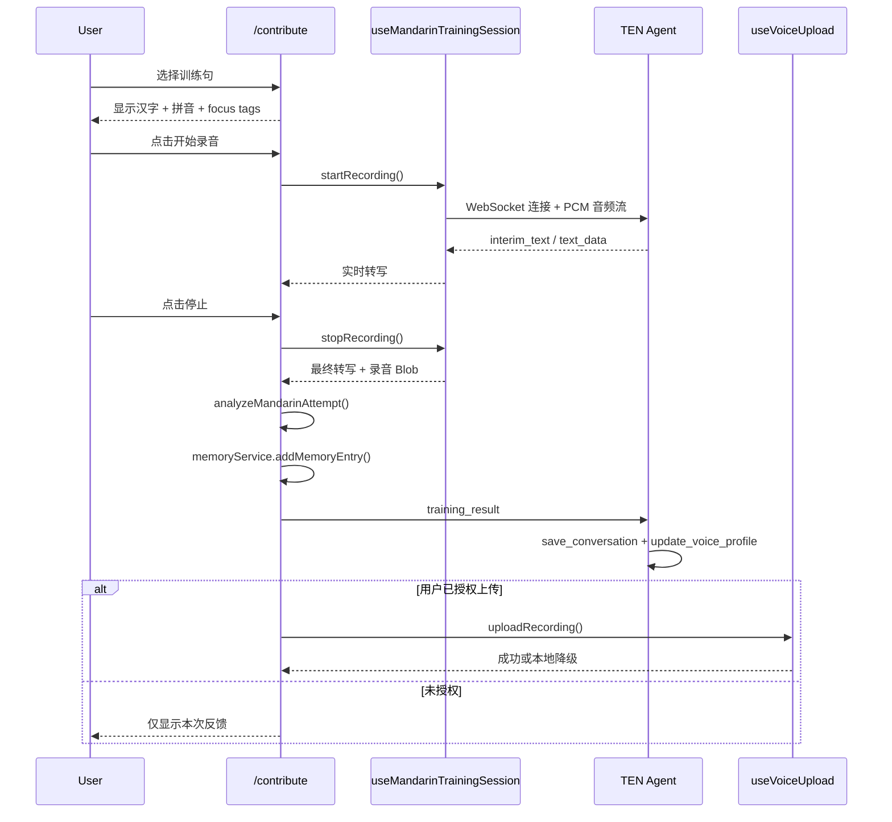

# VoxFlame 前端架构与交互设计指南

> 版本：2.0  
> 更新日期：2026-03-09  
> 目标读者：前端开发者、产品经理

这份文档只保留当前仍然有效的前端结构。`/contribute` 已不再是旧的 `chat / guided / free` 数据采集页，而是面向中文场景的训练与录音上传页。

---

## 1. 当前页面结构

```mermaid
graph TD
    A[Home (/)] -->|现在沟通| B[Communicate View (/?mode=communicate)]
    A -->|练习表达| C[Contribute Page (/contribute)]
    A -->|查看记忆/进展| D[后续页面]
```

- `Home (/)`：公开产品首页，负责解释“现在沟通 / 练习表达 / 查看进展与记忆”。
- `Communicate View`：实时沟通页，承接 starter phrase、快捷短语和实时代播。
- `Contribute Page (/contribute)`：中文训练页当前主页面，承接目标句、拼音、录后反馈、匿名上传和训练结果写回。

---

## 2. `/contribute` 当前交互闭环

### 2.1 页面目标

`/contribute` 的目标不是“尽可能多录音”，而是完成一个更克制的闭环：

1. 用户看到真实沟通高价值句。
2. 用户看到拼音和本次练习重点。
3. 用户开始录音并获取实时转写。
4. 录音结束后看到目标句 vs 系统听到的结果。
5. 用户决定是否把这次录音匿名上传。
6. 训练结果以最小结构写回本地记忆，并同步送入 TEN 记忆层。

### 2.2 当前状态块

| 区块 | 作用 | 关键数据 |
|------|------|----------|
| 页面头部 | 解释产品意图、当前贡献者、完成次数 | `displayName`, `completedCount`, `total_recordings` |
| 训练句卡片 | 展示句子、拼音、难点标签、来源 | `MandarinTrainingExercise` |
| 录音区 | 开始/停止录音，显示实时转写 | `useMandarinTrainingSession` |
| 反馈区 | 展示识别结果、差异和建议 | `analyzeMandarinAttempt` |
| 上传区 | 决定是否匿名上传，展示上传状态或本地降级 | `useVoiceUpload` |
| 记忆写回 | 记录训练摘要并把关键词送入 agent | `memoryService`, `sendTrainingResult` |

### 2.3 当前交互流

```mermaid
sequenceDiagram
    participant User
    participant UI as /contribute
    participant Session as useMandarinTrainingSession
    participant Agent as TEN Agent
    participant Upload as useVoiceUpload

    User->>UI: 选择训练句
    UI-->>User: 显示汉字 + 拼音 + focus tags
    User->>UI: 点击开始录音
    UI->>Session: startRecording()
    Session->>Agent: WebSocket 连接 + PCM 音频流
    Agent-->>Session: interim_text / text_data
    Session-->>UI: 实时转写
    User->>UI: 点击停止
    UI->>Session: stopRecording()
    Session-->>UI: 最终转写 + 录音 Blob
    UI->>UI: analyzeMandarinAttempt()
    UI->>UI: memoryService.addMemoryEntry()
    UI->>Agent: training_result
    Agent->>Agent: save_conversation + update_voice_profile
    alt 用户已授权上传
        UI->>Upload: uploadRecording()
        Upload-->>UI: 成功或本地降级
    else 未授权
        UI-->>User: 仅显示本次反馈
    end
```

### 2.4 当前边界

- 页面内反馈仍然是文本 / 标签级，不是医学级发音诊断。
- 训练历史趋势和个性化练习集还不在第一页闭环里。
- 训练结果写回已经是最小闭环：前端本地记忆 + 登录态后端同步 + TEN hotword / conversation 更新。
- 上传采用匿名 ID 和显式授权，未勾选时不自动上传。

---

## 3. 关键前端模块

### 3.1 页面入口

| 文件 | 作用 |
|------|------|
| `frontend/src/app/page.tsx` | 首页和沟通模式切换 |
| `frontend/src/app/contribute/page.tsx` | 中文训练与录音上传页 |

### 3.2 训练页核心模块

| 文件 | 作用 |
|------|------|
| `frontend/src/hooks/useMandarinTrainingSession.ts` | 训练页专用录音会话，管理 WebSocket、实时转写、结束等待 |
| `frontend/src/hooks/useVoiceUpload.ts` | 上传录音或本地降级，并写入结构化 metadata |
| `frontend/src/hooks/useContributor.ts` | 匿名贡献者身份与统计 |
| `frontend/src/lib/memory/memory-service.ts` | 训练摘要、本地记忆与登录态后端同步 |
| `frontend/src/lib/corpus/mandarin-training.ts` | 第一阶段高质量训练句、拼音、focus tags、来源 |
| `frontend/src/lib/training/mandarin-feedback.ts` | 目标句 vs 识别结果的最小反馈规则层 |
| `frontend/src/lib/audio/audio-processor.ts` | 浏览器侧 PCM 采集与 WAV 汇总 |
| `frontend/src/lib/websocket/asr-client.ts` | 训练页使用的轻量 WebSocket 客户端 |

### 3.3 当前数据结构

#### `MandarinTrainingExercise`

- `id`
- `text`
- `pinyin`
- `category`
- `difficulty`
- `focusTags`
- `keywords`
- `coachingTip`
- `source`

#### 上传 metadata

- `training_mode`
- `exercise_id`
- `exercise_text`
- `exercise_category`
- `focus_tags`
- `keywords`
- `recognized_text`
- `feedback_status`
- `missing_chars`
- `extra_chars`
- `source_label`
- `source_url`
- `upload_consent`

---

## 4. 当前维护建议

1. 新增训练句时，优先修改 `mandarin-training.ts`，不要继续往旧 `sentences.ts` 塞无来源数据。
2. 如果训练页要升级成更细的拼音 / 音节反馈，先扩展 `mandarin-feedback.ts`，不要直接把规则硬写进页面组件。
3. 当前训练结果已经按最小结构写回记忆，后续趋势图应优先复用现有 `keywords / focus_tags / feedback_status`，不要再造第二套埋点。
4. 如果后续要做趋势图、训练周报或个性化练习包，应新增独立模块，不把 `/contribute` 再膨胀回单页大全。

---

**总结**：前端当前的重点已经从“多模式数据采集”转向“让真实中文练习可反馈、可上传、可沉淀”。这要求页面保持短闭环、清晰授权、来源可追溯，并尽早把训练结果接入真实记忆层。
